# (PART\*) Student Activity {-}

# Explore the Epigenome

## Launch the Genome Browser Gateway

Go to [`https://genome.ucsc.edu/cgi-bin/hgGateway`](https://genome.ucsc.edu/cgi-bin/hgGateway). Ensure "Human" is selected under "Browse/Select Species".  


```
## Warning: replacing previous import 'ellipsis::check_dots_unnamed' by
## 'rlang::check_dots_unnamed' when loading 'tibble'
```

```
## Warning: replacing previous import 'ellipsis::check_dots_used' by
## 'rlang::check_dots_used' when loading 'tibble'
```

```
## Warning: replacing previous import 'ellipsis::check_dots_empty' by
## 'rlang::check_dots_empty' when loading 'tibble'
```

```
## Warning: replacing previous import 'ellipsis::check_dots_unnamed' by
## 'rlang::check_dots_unnamed' when loading 'pillar'
```

```
## Warning: replacing previous import 'ellipsis::check_dots_used' by
## 'rlang::check_dots_used' when loading 'pillar'
```

```
## Warning: replacing previous import 'ellipsis::check_dots_empty' by
## 'rlang::check_dots_empty' when loading 'pillar'
```

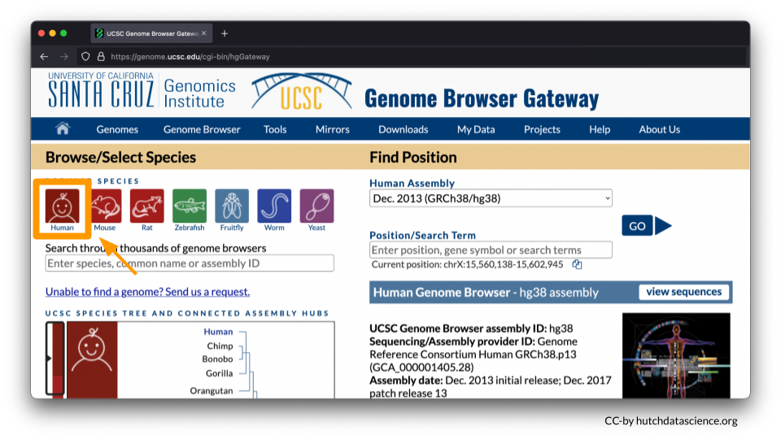

You will be working from the Human Assembly **March 2006 (NCBI/hg18)**. Make sure this is selected under the "Find Position" dropdown menu. Enter **HOXA7** in Position/Search Term and select GO. 


Your Genome Browser should now look like this:


## Clean up Visual Settings

You’ll now use the following directions to remove the default visual settings.

Scroll below to different menu options shown. 

* Under the "Mapping and Sequence" tab, Base Position should be set to **dense**. 
* Under the "Genes and Gene Predictions" tab,  RefSeq Genes should be set to **pack**.  
* All other features should be marked as **hide**. You will need to go through each of the menu options to make sure features are marked as “hide”. Please note you will need to open each menu option by select the  “+” to ensure all tracks are turned off (marked as hide). 

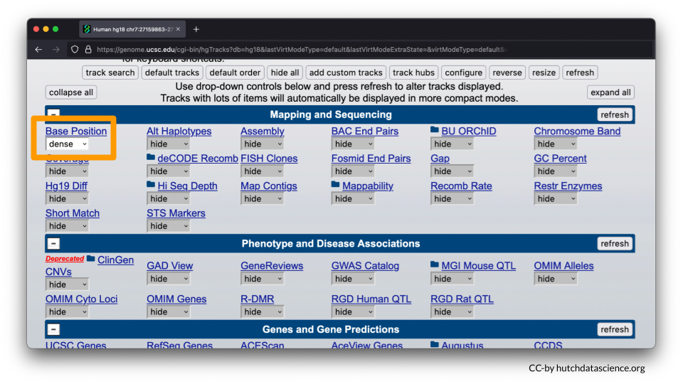
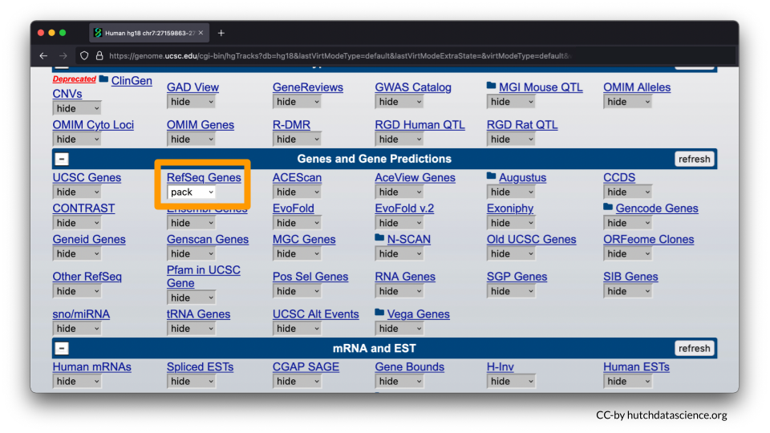

At the end of the browser page, select "refresh". 


Your browser should look like the image below, where only HOXA7 is shown. 

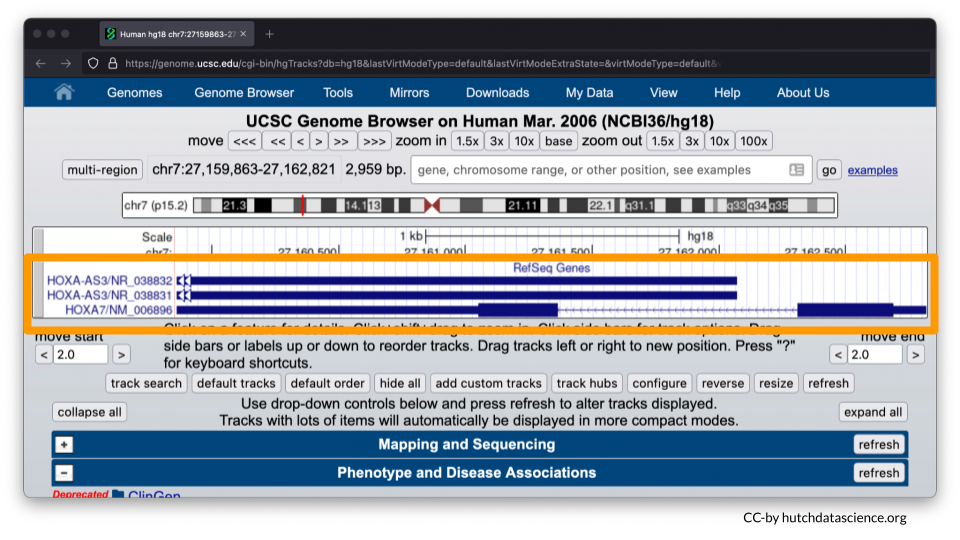

## Zooming Out

Zoom out your display by 10x, 3x or 1.5x to see HOXA1-HOXA13 genes on your browser. The zoom out value you’ll select will be dependent on your computer display screen. You may need to use the zoom in option if you’ve zoomed out the display beyond the HOXA1-HOXA13 genes. Zoom buttons can be clicked more than once.

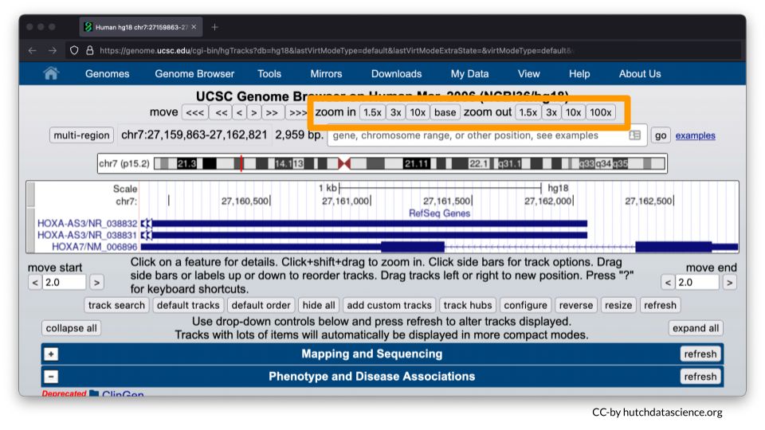

Ideally your browser should like the image below. 


Instead of zooming in and out, you can always manually enter your chromosome region of choice. For this exercise, try entering the following region: **chr7:27,087,367-27,235,317**. Click "go". 


<div class = "notice">
You could also enter **chr7:27,087,367-27,235,317** in the search bar at the start of this exercise instead of HOXA7. 
</div>

## Selecting Histone Marks

Now we’ll visualize histone marks to show that the same chromosome locus can have drastically different histone patterns.

Scroll down to the "Regulation" menu and click the **Broad Histone** track hyperlink.


Scroll down and deselect all boxes.


Select **H3K4me3** and **H3K27me3** marks for **H1-hESC** and **NHLF**. To learn more about these options you can click on their blue hyperlinks for more information. 


<div class = "notice">
**H3K4me3** is a known histone mark on Histone 3 (H3). It occurs on lysine 4 (K4) and has three methyl groups (me3) that indicate active gene expression. In other words, the DNA is open and ready to be accessed.


**H3K27me3** is a known histone mark on on Histone 3 (H3). It occurs on lysine 27 (K27) and has three methyl groups (me3) that indicate inactive gene expression. In other words, the DNA is closed off and cannot be accessed.

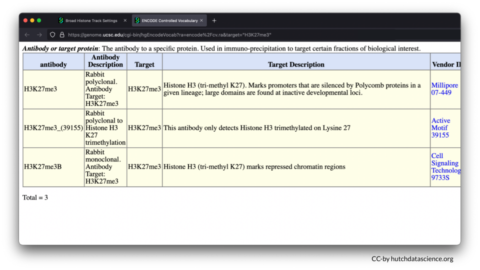

The **H1-hESC** cell line consists of embryonic stem cells.


The **NHLF** cell line consists of lung fibroblasts. Fibroblasts are important for building the connective structures around cells and healing wounds.


</div>

Scroll below and deselect the Peak views. You will only need Signal views. 

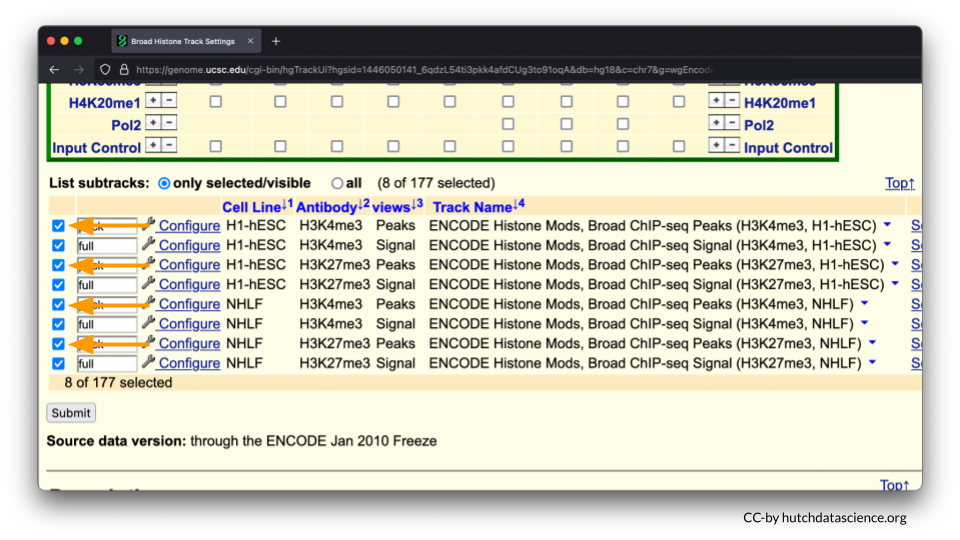

Your selected subtracks should only display Signal views as shown below. Click "Submit".

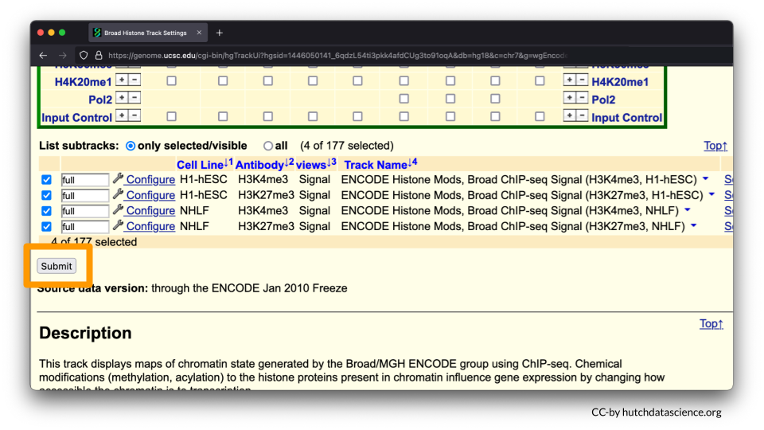

Scroll down, and your browser should look like the image below. 


## Comparing Histone Marks

Let's first examine the **H1-hESC** cell line (embryonic stem cells).

Signals are high for the H3K27me3 histone mark. You’ll also notice that H3K4me3 signals are minimal. This signal pattern demonstrates that embryonic stem cells are in the repressed chromatin configuration at the HOXA locus and indicates that HOXA genes in blue are not expressed in this cell line. 


Now, let's examine the **NHLF** cell line (lung fibroblasts).

The pattern is different for NHLF. H3K4me3 signals are high for the first half of the HOXA locus, but low for the second half of the locus. 

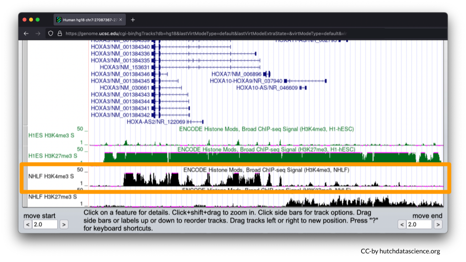

H3K27me3 signals are low and then high for the same locus. 


This signal pattern demonstrates that for lung fibroblasts only half of the HOXA locus is expressed while the other half is not expressed. Specifically, we can use the full image to see that HOXA1-7 are expressed (turned on).

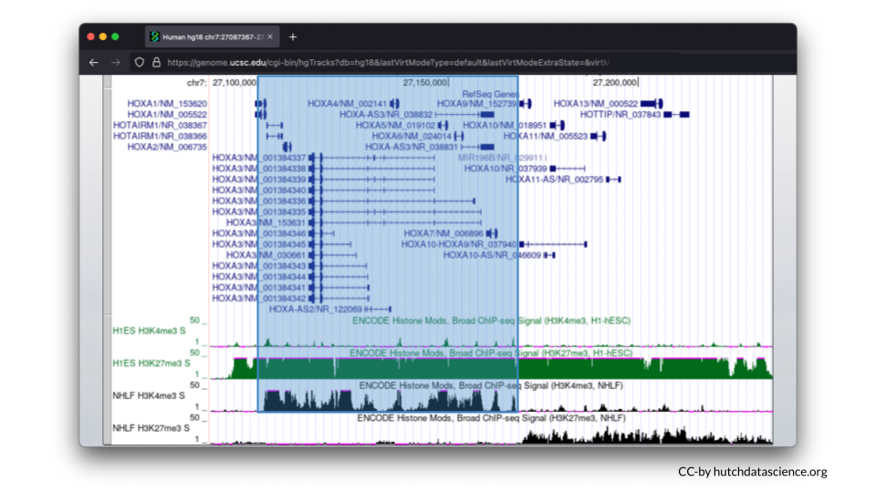

We can also see that HOXA9-13 is not expressed (turned off). 

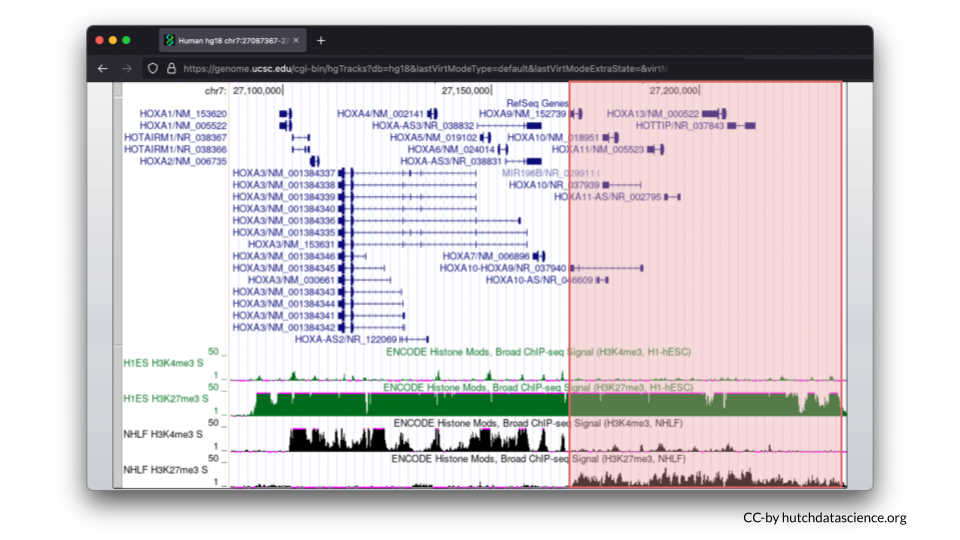
